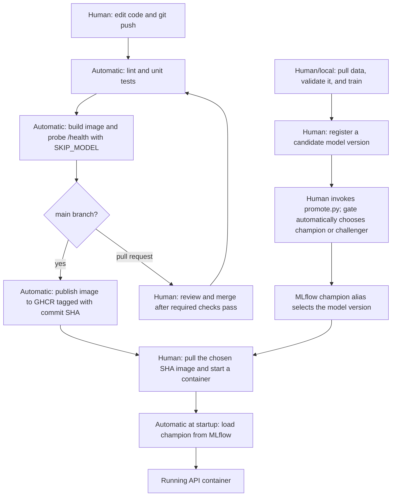

# Lab 5 Pipeline

```mermaid
flowchart TD
    A[Human: edit code and git push] --> B[Automatic: lint and unit tests]
    B --> C[Automatic: build image and probe /health with SKIP_MODEL]
    C --> D{main branch?}
    D -->|yes| E[Automatic: publish image to GHCR tagged with commit SHA]
    D -->|pull request| F[Human: review and merge after required checks pass]
    F --> B
    E --> G[Human: pull the chosen SHA image and start a container]
    H[Human/local: pull data, validate it, and train] --> I[Human: register a candidate model version]
    I --> J[Human invokes promote.py; gate automatically chooses champion or challenger]
    J --> K[MLflow champion alias selects the model version]
    K --> G
    G --> L[Automatic at startup: load champion from MLflow]
    L --> M[Running API container]
```

The commit SHA selects the code image. The `champion` alias selects the model independently. Deployment and starting the local promotion command still need a person in this lab.
